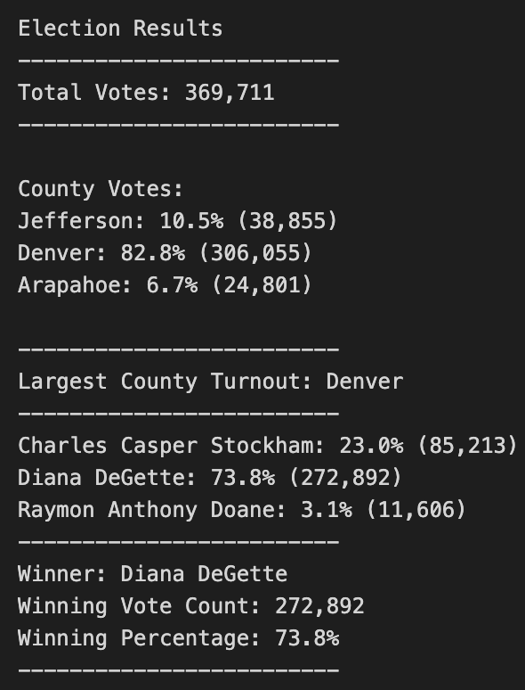

# PyPoll with Python

## Overview of Election Audit

The study looked at 369,711 election ballots from a US congressional precint in Colorado. Python script was used to tabulate the total number of votes cast, the total number of votes for each candidate, the percentage of votes for each candidate, and the winner of the election based on popular vote. The analysis also examined voter turnout per county. 

The goal is to assist the Colorado Board of Elections in certifying the results of a US congressional race using Python script that can automate the tabulation of election results for different districts. 

## Election-Audit Results
 
</img>
 

- There were 369,711 votes cast in this congressional election.
- Of the 369,711 votes, 82.8% (306,055 votes) came from Denver county while 10.5% came from Jefferson county (38,855 votes). Finally, the county of Arapahoe accounted for 6.7% of the votes (24,801 votes). 
- In this election, Denver county had the largest number of votes.
- Of the 369,711 votes, 73.8% were cast in favour of Diana DeGette with 272,892 votes. Meanwhile, 23.0% of the votes were cast in favour of Charles Casper Stockham with 85,213 votes. Finally, Raymon Anthony Doane secured 3.1% of the votes with 11,606 votes. 
- Diana DeGette won the election after receiving 272,892 votes that accounted for 73.8% of the total votes. 

## Election-Audit Summary

The writen python script is a great starter code for tabulating election results efficiently. With a few adjustments, it can be used to reveal more information about voting districts/counties and the distribution of a candidate's support throughout a political map. It can even be scaled up in order to tabulate results for nationwide elections such as the US presidential election. 

### Example 1: Mapping the Political Support of Candidates 

At the moment, the python script only reveals voter turnout when it filters through the counties of a precinct. A more useful piece of information, however, will be the percentage of votes in each county won by a candidate. This is useful information for political parties becasue it informs them about which counties they need to direct their campaigning efforts to in preparation for the next election. 

Our code can easily be edited to filter a candidate's votes by counties. Using several conditionals inside a for loop, we can go through the ballots and count the number of votes a candidate won in each county. By dividing each of those figures by the corresponding total votes cast in those counties, we can calculate the percentage of support won by a candidate in each of those areas.

### Example 2: Automating the US Presidential Election Results 

For the US presidential election, the same python script can be used with a few modifications to accomodate the electoral college process. In the US, a president is chosen not based on popular vote but by the number of electoral college votes a candidate wins. Each state has a certain number of electoral college votes determined by the number of senators and representatives it has in the House of Representatives. The most popular candidate of a state wins all of the electoral college votes of that state.  

Our code can count electoral college votes by first initializing counter variables for each presidential candidate to zero. Then, a dictionary called "electoral_votes" must be created such that the names of all 50 states plus the District of Columbia are set as keys and their corresponding amount of electoral college votes are set as values. 

The original Python code will be used to determine the most popular candidate per state. Results will be accumulated using a for loop in another dictionary called "state_outcomes" where state names will be set as keys while the popular vote winner of each state will be set as values. 

A for loop will go through each state of the "electoral_votes" dictionary and look up its winner in the "state_outcomes" dictionary. A conditional statement will then be used to increment the approriate candidate's vote counter variable with all of a state's electoral collge votes. The latter is accessed by the conditional statement from the "electoral_votes" dictionary. 

By the end of the loop, the candidate with more than half of the total electoral college votes will be declared the winner. 

